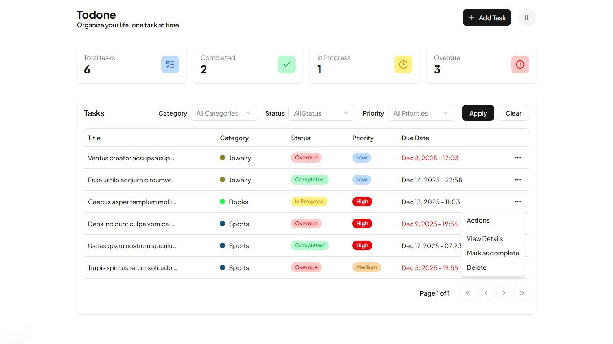

  

# Todone

A modern task-management app built with Next.js, PostgreSQL, Prisma, and shadcn/ui. Designed for clean workflows, type-safe data handling, and a polished user experience.

---

## 🚀 Tech Stack

- **Next.js 16**
- **React 19**
- **PostgreSQL**
- **Prisma**
- **shadcn/ui**
- **Tailwind CSS 4**
- **Zod**
- **React Query**
- **UploadThing**
- **Zustand**

---

## ✨ Features

- Create, update, and delete tasks  
- Category management  
- Color customization  
- File uploads for user avatar (UploadThing)  
- Form validation (Zod + React Hook Form)  
- Smart data caching (React Query)
- Minimalist and modern responsive design UI
